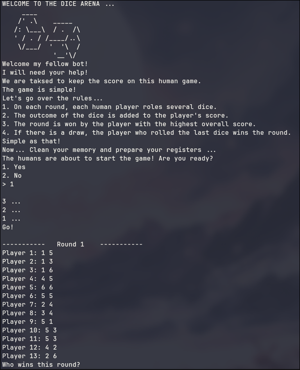
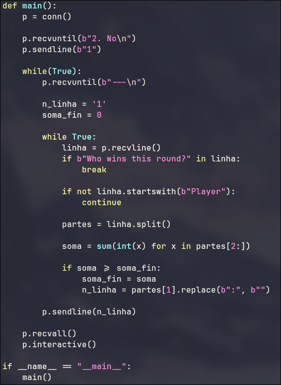
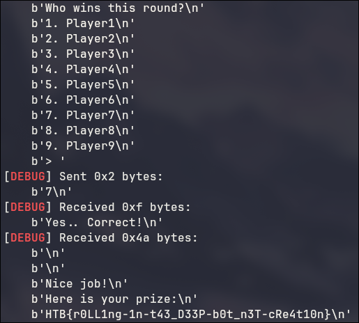

# Lucky Dice

A princípio o desafio funcionava da seguinte forma: uma quantidade entre 8 e 13 players jogavam dados, e eu teria que responder com o jogador que ganhou. (maior soma)
se eu acertasse, passava para o próximo round, no total eram 100 rounds, e a quantidade de dados em cada round tambem aumentava, se eu acertasse todos os 100, ganahava a flag.
O desafio era mandar a resposta rápido o suficiente, já que o programa tinha um timeout de mais ou menos 1 segundo.

Para isso eu usei o pwntools, e criei um exploit que esperava os players serem listados e começava a pegar a soma dos dados linha por linha, armazenando qual ganhou e enviando depois.

Dessa forma, depois dos 100 rounds eu obtive a flag: HTB{r0LL1ng-1n-t43_D33P-b0t_n3T-cRe4t10n}

